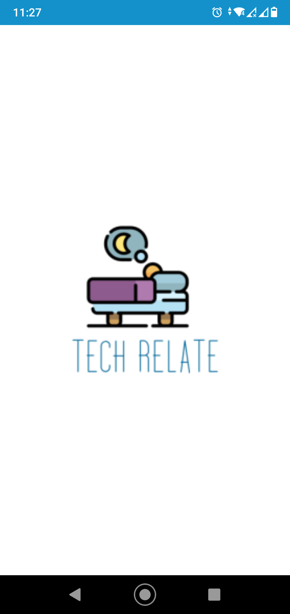
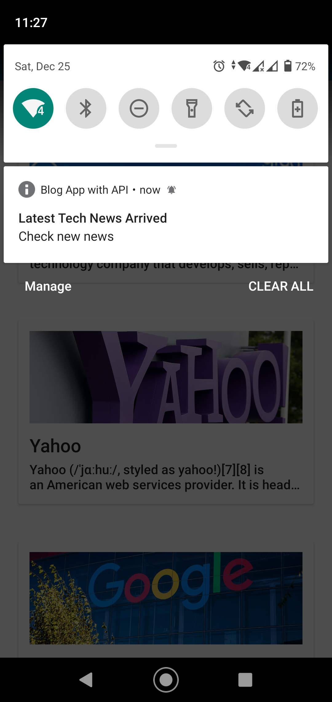
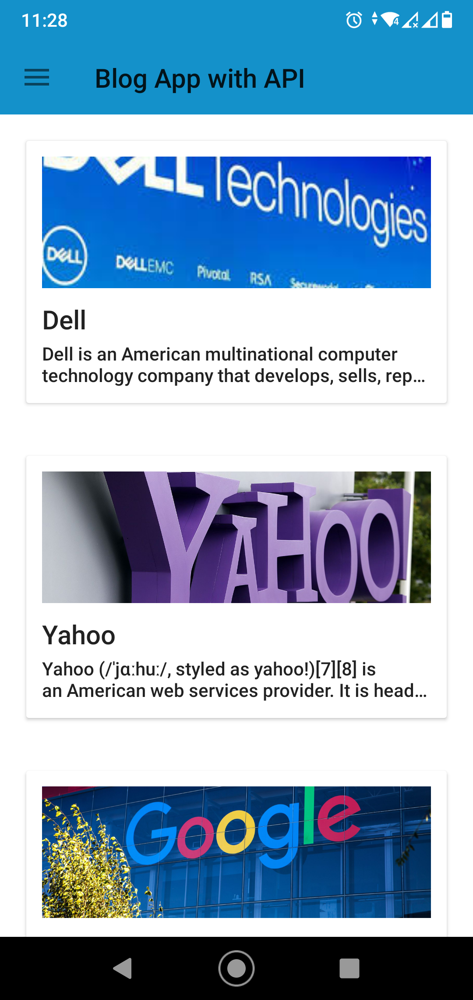
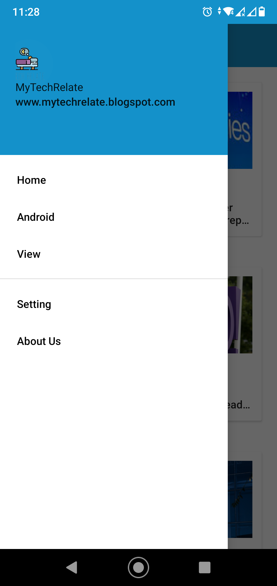
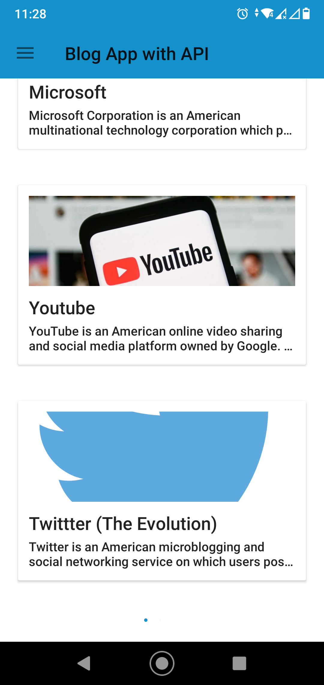

Here Used Library and features:

1. Blog API by Google((website: https://mytechrelate.blogspot.com/)).
2. Retrofit library and gson Converter library for fetch the Json File from API and to convert into Java object.
3. Jsuop library to encode the html text to plain text.
4. Push notification(Cloud Messaging) by Google Firebase to interact with user.
5. Webview to see the full news by clicking on any specific news.

Here is the splach screen of this app:

I integrated push notification in this app:

Then the newses and its short line coming from the Blogger API(website: https://mytechrelate.blogspot.com/) that provided by google:

Then I added a Navigation View in a drawer layout:

A latest design of progress bar (Spin Kit) used for display the progressing that I take use from github:

